# TubeEase

A simple, senior-friendly client-side tool to interact with YouTube's API. 

**Designed specifically for older adults and users who are not comfortable with technology.** TubeEase features only 2-3 large, clearly visible buttons to make YouTube searches as simple as possible.

This is an **open-source, non-profit project** created to help bridge the digital divide and make technology more accessible to more people.

**Important Note:** To use Google's free YouTube API, a one-time technical setup is required. This configuration step needs to be completed by someone with basic technical knowledge (a family member, friend, or tech-savvy person). Once configured, the tool becomes completely simple to use for everyone.

## How to Use
1. Download all files from this repository to your computer
2. Follow the setup instructions below to get your YouTube API key
3. Configure your API key in the `config.js` file
4. Open `ita.html` (or your preferred language version) and you're ready to go!

*Note: More languages coming soon! Currently available: 
Italian (ita.html), English (eng.html), Spanish (esp.html), 
Chinese (chi.html) and Hindi (hin.html)*

## Setup Instructions

To use TubeEase, you need to get a YouTube API key from Google Cloud Console. Follow these steps:

### Process Overview (details below)

```mermaid
flowchart TD
    A[Start] --> B["Access Google Cloud Console (console.cloud.google.com)"]
    B --> C{Have a Project?}
    C -->|No| D["Create New Project (Select project → New Project)"]
    C -->|Yes| E["Navigate to APIs & Services → Library"]
    D --> E
    E --> F["Search and Enable YouTube Data API v3"]
    F --> G["Go to APIs & Services → Credentials"]
    G --> H["Create Credentials → API Key"]
    H --> I["Click Restrict Key (Security Step)"]
    I --> J["Set API restrictions to YouTube Data API v3 only"]
    J --> K["Save API Key Settings"]
    K --> L["Copy Your API Key"]
    L --> M["Rename config file to config.js"]
    M --> N["Open config.js in TubeEase folder"]
    N --> O["Replace 'your-youtube-api-key-here' with actual key"]
    O --> P["Save config.js"]
    P --> Q["Open ita.html (or your language version) in browser"]
    Q --> R[Ready to Use TubeEase! 🎯]
    
    style A fill:#e1f5fe
    style P fill:#c8e6c9
    style I fill:#fff3e0
    style J fill:#fff3e0
```



### Step 1: Access Google Cloud Console
1. Go to [Google Cloud Console](https://console.cloud.google.com/)
2. Sign in with your Google account
3. If you don't have a project yet, create a new one by clicking "Select a project" → "New Project"
4. Give your project a name and click "Create"

### Step 2: Enable YouTube Data API v3
1. In the left sidebar, click on "APIs & Services" → "Library"
2. Search for "YouTube Data API v3"
3. Click on "YouTube Data API v3" from the results
4. Click the "Enable" button

### Step 3: Create an API Key
1. In the left sidebar, click on "APIs & Services" → "Credentials"
2. Click the "Create Credentials" button at the top
3. Select "API Key" from the dropdown menu
4. Your API key will be generated and displayed

### Step 4: Restrict Your API Key (Important for Security)
1. After creating the API key, click on the "Restrict Key" button (or click on the key name to edit it)
2. Under "API restrictions":
   - Select "Restrict key"
   - Check only "YouTube Data API v3" from the list
3. Click "Save"

### Step 5: Configure TubeEase
1. In your local TubeEase folder, rename the configuration file to `config.js`
2. Open the `config.js` file
2. Find this section:
```javascript
const CONFIG = {
    YOUTUBE_API_KEY: 'your-youtube-api-key-here',
    YOUTUBE_API_URL: 'https://www.googleapis.com/youtube/v3/search'
};
```
3. Replace `'your-youtube-api-key-here'` with your actual API key (keep the quotes)
4. Save the file

### Example
Your `config.js` should look like this:
```javascript
const CONFIG = {
    YOUTUBE_API_KEY: 'AIzaSyBxxxxxxxxxxxxxxxxxxxxxxxxxxxxxxx',
    YOUTUBE_API_URL: 'https://www.googleapis.com/youtube/v3/search'
};
```

## Important Notes
- Keep your API key private and never share it publicly
- The API key has usage limits - check your quota in Google Cloud Console
- If you encounter issues, make sure the YouTube Data API v3 is enabled for your project

## Troubleshooting
- **"API key not valid"**: Check that you copied the key correctly and that YouTube Data API v3 is enabled
- **"Access denied"**: Make sure your API key restrictions are set correctly
- **"Quota exceeded"**: You've reached the daily limit for API calls

## Support
If you need help, check the [YouTube Data API documentation](https://developers.google.com/youtube/v3) or create an issue in this repository.

---

Happy YouTubing! 🎬